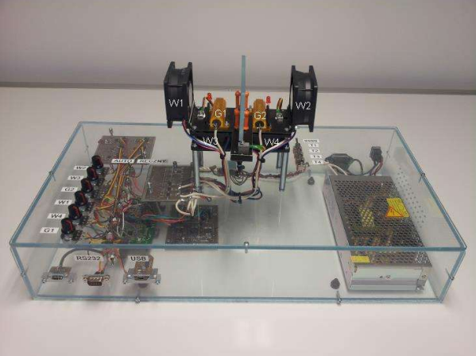
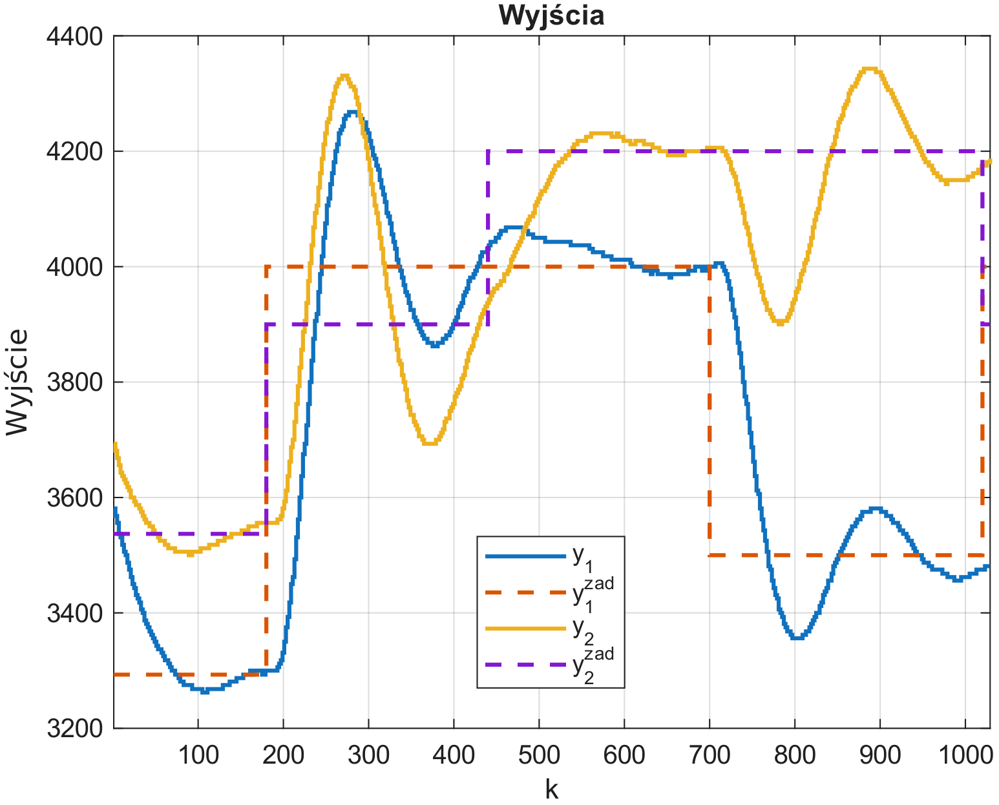
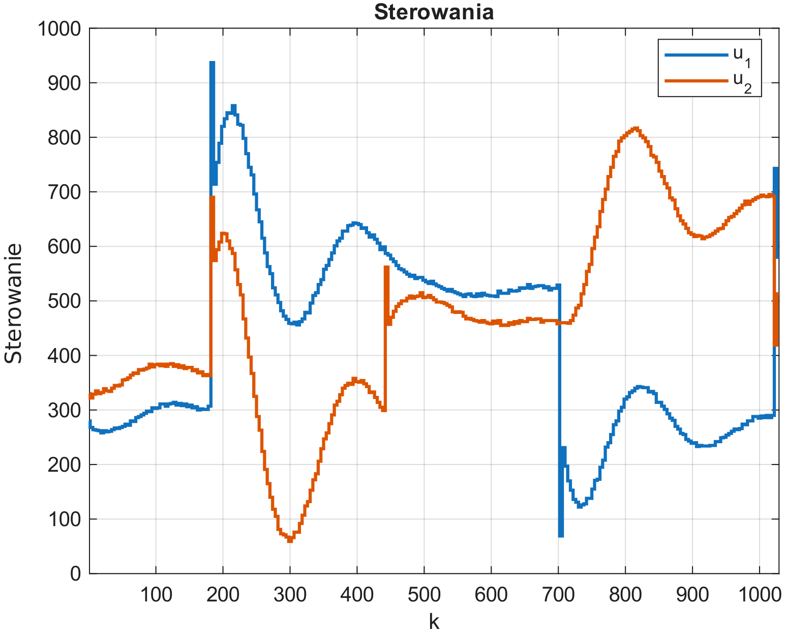
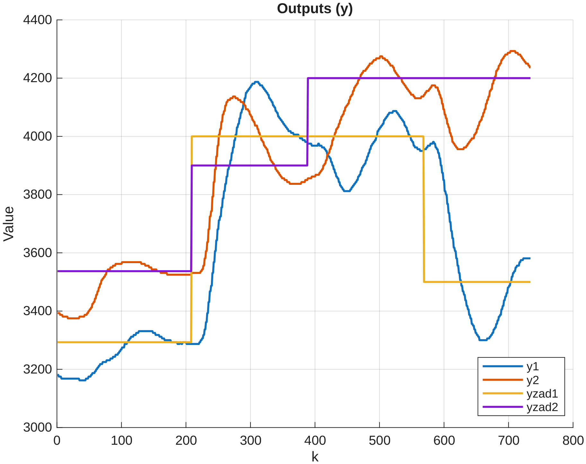
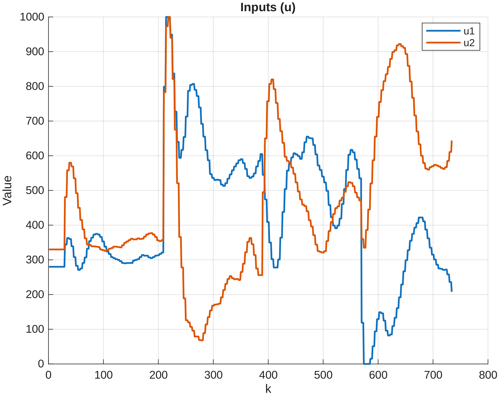
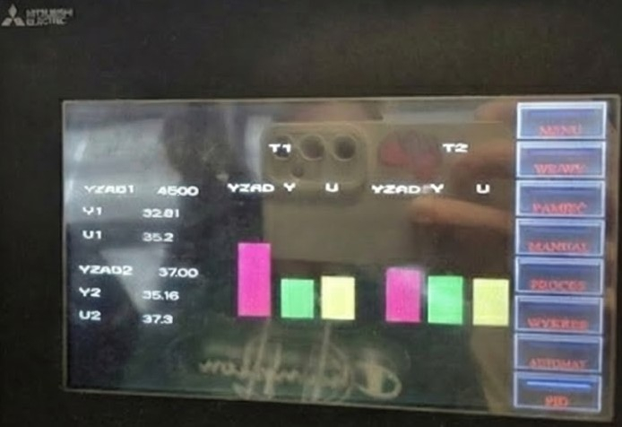

# PLC MIMO Control: Coupled Thermal Process

## 📖 O projekcie
Niniejsze repozytorium prezentuje autorską implementację algorytmów sterowania dla wielowymiarowego (MIMO) obiektu cieplnego. Celem projektu było zaprojektowanie od podstaw, napisanie w języku Structured Text (ST) oraz uruchomienie na fizycznym sterowniku PLC własnego, dwupętlowego regulatora PID oraz analitycznego, predykcyjnego regulatora DMC (Dynamic Matrix Control). 

Projekt obejmuje również stworzenie interfejsu HMI do monitorowania procesu, obsługę komunikacji Modbus RTU oraz implementację nadrzędnych mechanizmów bezpieczeństwa (Safety).

  
   
  <em>(Fizyczny obiekt badawczy. Zdjęcie pochodzi z materiałów dydaktycznych WEiTI PW).</em>

## 🛠️ Wykorzystane Technologie
* **Sterowanie:** PLC MELSEC FX5U (Mitsubishi).
* **Oprogramowanie:** GX Works 3 (język ST), GT Designer 3 (wizualizacja HMI), MATLAB (akwizycja danych i obliczanie macierzy DMC).
* **Komunikacja z komputerem:** Socket Communication (odbiór danych poprzez MATLAB).
* **Komunikacja z obiektem:** MODBUS RTU po standardzie napięciowym RS485.

---

## 🌡️ Charakterystyka Obiektu (MIMO)

Obiektem regulacji jest stanowisko cieplne, charakteryzujące się silnymi sprzężeniami krzyżowymi (oddziaływanie ciepła z jednej strefy na czujnik w drugiej strefie).
* **Elementy wykonawcze (Wejścia):** 2 rezystory mocy pełniące rolę grzałek (G1, G2), sterowane sygnałem w zakresie 0-100%.
* **Elementy pomiarowe (Wyjścia):** Czujniki temperatury magistrali OneWire odczytujące temperaturę przy grzałkach (T1, T3).
* **Zakłócenia:** stale pracujące z 50% mocą wysokoobrotowe wentylatory chłodzące układ.

**Mechanizm Bezpieczeństwa (Safety):** W kodzie zaimplementowano nadrzędny mechanizm, który cyklicznie monitoruje odczyty. W przypadku wykrycia temperatury krytycznej $250^\circ C$ (wartość 25000 w rejestrze), algorytm natychmiastowo odcina zasilanie odpowiedniej grzałki i zeruje zmienne sterujące, zapobiegając uszkodzeniu elementów stanowiska.

---

## 🧠 Zaimplementowane Algorytmy (Structured Text)

Zrezygnowano z gotowych bloków funkcyjnych producenta na rzecz własnej implementacji w języku ST, co pozwoliło na głęboką analizę działania algorytmów. Obliczenia osadzono w przerwaniu czasowym (Fixed Scan = 4s), co zapewniło ścisły determinizm czasowy.

### 1. Autorski, Dwupętlowy Regulator PID
Zaimplementowano równania różnicowe wraz z uwzględniem ograniczeń sygnału sterującego. 

**Analiza działania:** Z uwagi na silne sprzężenia krzyżowe obiektu (wpływ grzałki 1 na czujnik 3 i odwrotnie) oraz jednoczesne skoki wartości zadanych wywoływane przez automat testowy, w przebiegach początkowych widoczne są przeregulowania. Proces jest trudny w sterowaniu bez zastosowania członów odsprzęgających, jednak ostatecznie algorytm z powodzeniem tłumi oscylacje i sprowadza układ do wartości zadanej. Dodatkowo z powodu ograniczonego czasu laboratoryjnego, regulatory nie zostały w pełni dostrojone, co również wpływa na charakterystykę przebiegów.

  
  
   
  <em>Przebiegi regulacji PID. Z lewej: temperatury (Y) i wartości zadane. Z prawej: sygnał sterujący grzałkami (U).</em>

### 2. Regulator Predykcyjny DMC 2x2
Implementacja zaawansowanego algorytmu Dynamic Matrix Control bezpośrednio na sterowniku PLC. 
* Pozyskano z fizycznego obiektu 4 odpowiedzi skokowe (uwzględniające tory główne i sprzężenia).
* Przetworzono dane w systemie MATLAB w celu wygenerowania gotowych macierzy wzmocnień $K_e$ oraz wektorów $K_u$ dla horyzontu dynamiki $N=20$ i sterowania $N_u=5$.
* Algorytm zaimplementowano w języku ST w tzw. wersji oszczędnej, minimalizując złożoność obliczeniową pętli na sterowniku PLC.

**Analiza działania:** Zaimplementowanie algorytmu predykcyjnego dla obiektu MIMO na przemysłowym PLC to duże wyzwanie obliczeniowe. Przebiegi charakteryzują się gasnącymi oscylacjami, co wynika ze złożoności dynamiki obiektu oraz sztywnych ram czasowych narzuconych przez automat stanów. Pomimo tych rygorów, analityczny regulator predykcyjny zachowuje stabilność i skutecznie wymusza na układzie podążanie za zadaną trajektorią.

  
  
   
  <em>Przebiegi regulacji DMC. Z lewej: temperatury (Y) i wartości zadane. Z prawej: sygnał sterujący grzałkami (U).</em>

---
*Pełne sprawozdanie z projektu wraz z analizą przebiegów regulacji oraz bardziej szczegółowym opisem implementacji algorytmów dostępne jest w `docs/sprawozdanie.pdf`.*

---

## 🖥️ Interfejs Operatora (HMI)

W środowisku GT Designer stworzono ekran operatorski służący do monitorowania procesu z wykorzystaniem protokołu Modbus RTU. 
Interfejs prezentuje na żywo wartości zadane (YZAD), procesowe zmienne mierzone (Y) oraz wysterowanie elementów wykonawczych (U). Dane liczbowe wsparto wielokolorowymi wykresami słupkowymi , pozwalającymi na szybką, wzrokową ocenę uchybu i natężenia grzania.

---
*Pliki źródłowe z implementacją algorytmów w języku ST dostępne są w folderze `src/`.*  
*Natomiast skrypty MATLAB do obliczeń offline (np. generowanie macierzy regulatora DMC) czy komunikacji znajdują się w folderze `scripts/`.*

---

## 👥 Autorzy
* **Dominik Bijoch**
* **Michał Dobrowolski**
* **Michał Paradowski**

## 📄 Licencja
Projekt ma charakter edukacyjny. Kod źródłowy udostępniany jest na licencji MIT.

---
Projekt zespołowy został zrealizowany w ramach zajęć laboratoryjnych z przedmiotu **Projektowanie układów sterowania (PUST)** na Politechnice Warszawskiej (WEITI), semestr 25Z.
